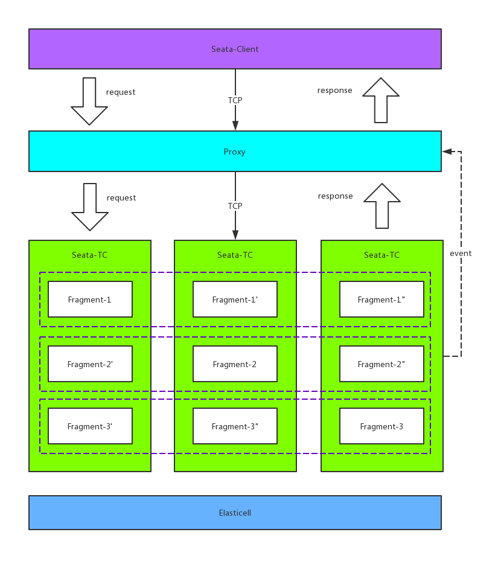

# TaaS
TaaS is a highly available server-side component of a distributed transaction solution compatible with [Seata](https://github.com/seata/seata) (after version 0.5), developed using Golang, by [InfiniVision](http://infinivision.cn) contributed to the Seata open source community.

## Feature
- High availability, fault-tolerance
- Auto-Rebalance
- Linear scalability
- Strong consistent metadata storage

## Architecture


### Seata-TC
The transaction coordinator process, each process contains multiple `Fragment`

### Proxy
A stateless node that provides the correct route to the outside and sends the request to the corresponding `Fragment` Leader node.

### Elasticell
[Elasticell](https://github.com/deepfabric/elasticell) is a distributed Key Value store with strong consistency and reliability to store the metadata.

## Design
### High Performance
The performance of Taas is directly proportional to the number of machines. To support this feature, the minimum unit for processing global transactions in Taas is a `Fragment`, which sets the number of concurrent global active transactions supported by each `Fragment` at startup. Taas samples each `Fragment` periodically according to a configurable interval, and Taas will generate a new `Fragment` to handle more concurrency as soon as existing system exceeds the saturation ratio, which is also configurable.

### High availability
Each `Fragment` has multiple replication sets and a single Leader, the requests are processed by the Leader. When the Leader fails, the system will generate a new Leader to process the requests. During the election of the new Leader, the `Fragment` does not provide services externally---the usual interval is a few seconds.

### Strong consistent
Taas itself does not store any metadata of transaction, actually they are stored within[Elasticell](https://github.com/deepfabric/elasticell). [Elasticell](https://github.com/deepfabric/elasticell) is a distributed KV storage engine compatible with `Redis` protocol, it adopts `Raft` mechanism to guarantee the strong consistency.

### Auto-Rebalance
As the system runs, there will be many `Fragment`s and their copies in the system, which will result in uneven distribution of `Fragment` on each machine, especially when the old machine goes offline or the new machine goes online. When Taas starts, it will select 3 nodes as the scheduler, which is responsible for scheduling these `Fragment`s to ensure that the number of `Fragment`s and the number of Leaders on each machine are approximately equal. The scheduler will also maintain the number of replications of each `Fragment` at the specified amount.

## Quickstart
```bash
git clone https//github.com/seata/taas.git
docker-compose up -d
```

### Seata Service Address
The service listens by default on port 8091, modifying the server address experience corresponding to Seata.

### Seata UI
Visit WEB UI `http://127.0.0.1:8084/ui/index.html`

## About InfiniVision
InfiniVision is a technology-driven enterprise service provider that leverages AI, cloud computing, blockchain, big data, and IoT edge computing technologies to help traditional enterprised benefit from cutting edge technologies. InfiniVision actively embraces open source culture, well-known face recognition solution [InsightFace](https://github.com/deepinsight/insightface), as well as distributed storage engine [Elasticell](https://github.com/deepfabric/elasticell) are all open source products of InfiniVision.


